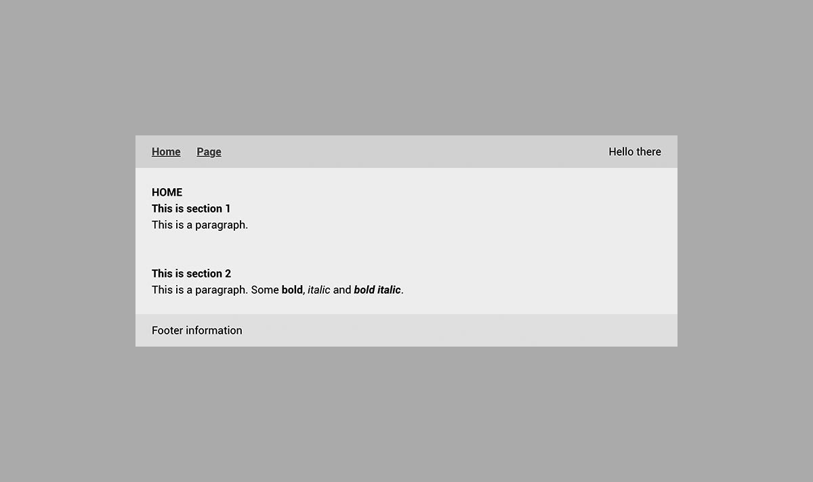

<p align="center">
  
</p>
<p align="center">
  <strong>SPA starter</strong> is a starter template for single page applications.
  <br>
  <b>Stack:</b>
  <b><a href="https://babeljs.io">Babel</a></b>,
  <b><a href="https://jgthms.com/minireset.css/">minireset.css</a></b>,
  <b><a href="https://pugjs.org">Pug</a></b>,
  <b><a href="https://sass-lang.com">Sass</a></b>,
  <b><a href="https://vuejs.org">Vue.js</a></b>,
  <b><a href="https://router.vuejs.org">Vue Router</a></b>,
  <b><a href="https://webpack.js.org">Webpack</a></b>.
</p>

- - -

## 📝 Table of contents
- [**Prerequisites**](#prerequisites)
- [**Commands**](#commands)
- [**Project structure**](#project-structure)
- [**Layout structure**](#layout-structure)
- [**Constant per environment**](#constant-per-environment)
- [**Cache busting**](#cache-busting)
- [**Authors**](#authors)
- [**Contributing**](#contributing)
- [**License**](#license)

- - -

<a name="prerequisites"></a>
## ⚙️ Prerequisites
- [**asdf**](https://github.com/asdf-vm/asdf)
- [**Make**](https://www.gnu.org/software/make/)
- [**Node.js**](https://nodejs.org)
- [**Yarn**](https://yarnpkg.com)

<a name="commands"></a>
## ⌨️ Commands
### Serve
```makefile
## Serve site at http://localhost:3000 with hot reloading

make
```

💡 This command will also **install dependencies** on first run and when `package.json` or `yarn.lock` files are updated.

### Build
```makefile
## Build site for production use

make build
```

💡 This command will also **install dependencies** on first run and when `package.json` or `yarn.lock` files are updated.

### Help
```makefile
## List available commands

make help
```

<a name="project-structure"></a>
## 🗄️ Project structure
```
.
├── assets                   # ASSETS
│   ├── fonts                # Font assets
│   │   └── roboto           # Roboto from Google Fonts (TTF, WOFF, WOFF2)
│   │
│   └── images               # Image assets
│       ├── favicon.ico      # Favicon (placeholder by default)
│       └── unicorn.jpg      # Sample image
│
│
├── documentation-images     # PROJECT DOCUMENTATION IMAGES
│
│
├── sass                     # SASS STYLE
│   ├── base                 # Base style
│   │   ├── _all.sass        # Importing all stylesheets
│   │   ├── generic.sass     # Style for generic elements (html, body, etc.)
│   │   └── helpers.sass     # Helper classes (modifiers)
│   │
│   ├── dev                  # Development utilities
│   │   ├── shame.sass       # WIP style or dirty hacks
│   │   └── structure.sass   # Highlighting site structure (import commented by default)
│   │
│   ├── fonts                # Fonts style
│   │   ├── _all.sass        # Importing all stylesheets
│   │   └── roboto.sass      # @font-face style for Roboto
│   │
│   ├── layout               # Layout style
│   │   ├── _all.sass        # Importing all stylesheets
│   │   └── layout.sass      # Very light starter style for structure elements and titles
│   │
│   └── utilities            # Utilities
│       ├── animations.sass  # Some basic animations
│       ├── mixins.sass      # A few useful mixins (available in all .vue and .sass files)
│       ├── transitions.sass # Vue.js transitions (imported in app.vue)
│       └── variables.sass   # Variables for colors, typography, etc. (available in all .vue
|                            # and .sass files)
│
│
├── src                      # VUE.JS/JAVASCRIPT SOURCE FILES
│   ├── pages                # Pages
│   │   ├── index.vue        # Home page
│   │   └── page.vue         # Sample page
│   │
│   ├── router               # Router
│   │   └── index.js         # Vue.js router configuration and initialization
│   │
│   ├── app.js               # Vue.js application configuration and initialization
│   ├── app.vue              # Main Vue.js component
│   └── index.html           # HTML index used to render the website
│
│
├── webpack                  # WEBPACK CONFIGURATION PER ENVIRONMENT AND UTILITIES
│   ├── common.js            # Shared between development and production environments
│   ├── dev.js               # Development environment
│   ├── prod.js              # Production environment
│   └── utils.js             # Utilities to create a new environment easily
│
│
├── .babelrc                 # Presets and plugins to use, used by Babel
├── .gitignore               # Files and folders ignored by Git
├── .tool-versions           # Which version to use locally for each language, used by asdf
├── LICENSE                  # License
├── Makefile                 # Commands for this project
├── package.json             # JavaScript dependencies, used by Yarn
├── README.md                # Project documentation
└── yarn.lock                # Tracking exact versions for JavaScript dependencies, used by Yarn
```

<a name="layout-structure"></a>
## 🖥 Layout structure


The starter comes with a simple layout, structured like the following:
```pug
// Wrapper
.wrapper
  // Header
  header.header
    .container
      …

  // Main
  main.main
    // Section (repeatable)
    section.section
      .container
        …

  // Footer
  footer.footer
    .container
      …
```

### Highlighting site structure


There is also a **Sass utility allowing to highlight the site structure** (pretty useful in development). Simply uncomment [`@import "dev/structure.sass"` in `app.vue`](src/app.vue#L58) if you want to use it.

<a name="constant-per-environment"></a>
## ⚙️ Constant per environment
Follow these steps if you want to define a constant that can change based on Webpack environment.

**Step 1:** Declare the constant in `package.json` (usually for development environment):

```json
"configuration": {
  "definePlugin": {
    "SOME_CONST": "Hello there"
  }
}
```

**Step 2:** Override the constant by editing the related `webpack/[env].js` file:

```js
utils.definePlugin({
  SOME_CONST: "Hello from production"
})
```

**Now you can use this constant in every `.vue`/`.js` file inside `src`** and it will change depending on Webpack environment.

<a name="cache-busting"></a>
## 🍱 Cache busting
Our strategy for cache busting is to automatically append a `.[generated-hash]` to each asset file name. You can read more about caching in [Webpack documentation](https://webpack.js.org/guides/caching/).

<a name="authors"></a>
## ✍️ Authors
- [**@Awea**](https://github.com/Awea) - Idea and initial work
- [**@mmaayylliiss**](https://github.com/mmaayylliiss) - Design, code/documentation review

<a name="contributing"></a>
## 🤜🤛 Contributing
**Contributions, issues and feature requests are welcome!** See the list of [contributors](../../graphs/contributors) who participated in this project.

<a name="license"></a>
## 📄 License
**SPA starter** is licensed under the [GNU General Public License v3.0](LICENSE).
